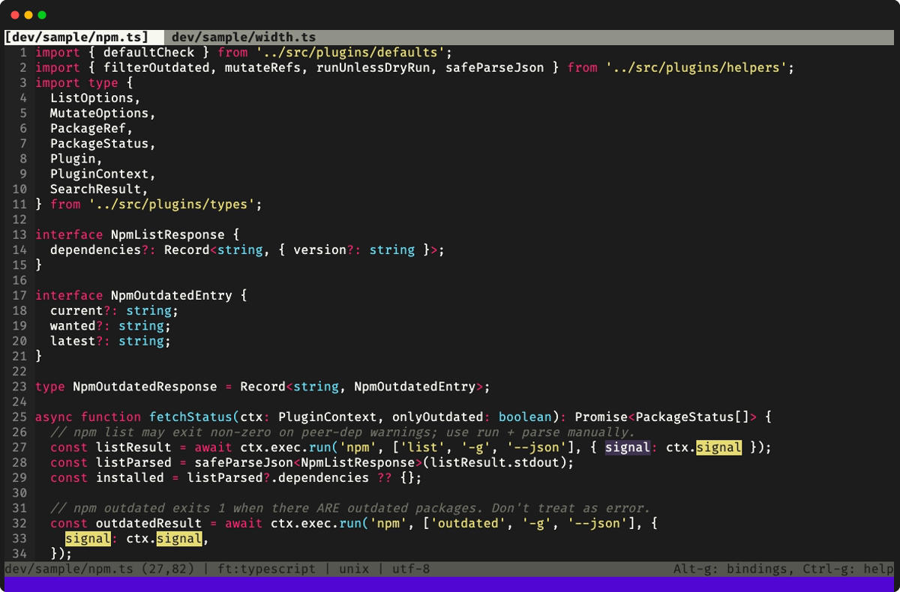

# Mojokai for micro

Mojokai is a truecolor colorscheme for the [micro](https://micro-editor.github.io/) text editor. It uses Monokai colors on a dark `#1c1c1c` background.



## Requirements

- micro 2.0 or later.
- A terminal that can show 24-bit color (truecolor).

## Install

1. Clone the repository:

   ```sh
   git clone https://github.com/jv-k/micro-mojokai-colorscheme.git
   cd micro-mojokai-colorscheme
   ```

2. Install the colorscheme. Use one of these two commands:

   ```sh
   npm run copy   # copies the file into your micro config
   npm run link   # makes a symlink, so changes in this repository show at once
   ```

   The two commands write to `$MICRO_CONFIG_HOME`. If this variable is not set, they write to `~/.config/micro`.

3. In micro, press `Ctrl-e` and type `set colorscheme mojokai-tc`.

## Install with an AI agent

A coding agent, for example Claude Code or Codex, can do the installation for you. Read the prompt below, then copy it and give it to your agent:

```text
Install the Mojokai colorscheme for the micro text editor.

1. Run `micro -version`. If micro is not installed, stop and tell me.
2. Clone the repository into a temporary directory:
   git clone https://github.com/jv-k/micro-mojokai-colorscheme.git
3. Find the micro config directory. Use $MICRO_CONFIG_HOME if it is set. If it is not set, use ~/.config/micro.
4. Copy mojokai-tc.micro into the colorschemes/ directory of the config directory. Make the directory if it does not exist. Copy the file. Do not make a symlink to the temporary directory.
5. If a file with the same name is already there, do not overwrite it. Show me the differences and ask me first.
6. In settings.json in the config directory, set "colorscheme" to "mojokai-tc". Keep all other settings. If the file does not exist, make it.
7. If the micro version is 2.0.15 or later, also set "truecolor" to "on" in settings.json. If the version is earlier, tell me to add `export MICRO_TRUECOLOR=1` to my shell profile. Do not change my shell profile.
8. Delete the temporary directory. Then tell me which files you changed.
```

## Turn on truecolor

micro shows the exact colors only when truecolor is on. When truecolor is off, micro changes each color to the nearest color in a 256-color palette.

- In micro 2.0.15 and later, press `Ctrl-e` and type `set truecolor on`.
- In earlier versions, set the variable `MICRO_TRUECOLOR=1` before you start micro.

## Update

How you update depends on how you installed Mojokai:

- If you used `npm run copy`, go to your clone of this repository. Run `git pull`, then run `npm run copy` again.
- If you used `npm run link`, go to your clone of this repository and run `git pull`. The symlink points to the new file.
- If you used the AI agent prompt, give the prompt to your agent again. The agent shows you the differences and asks before it replaces the old file.

Then, in micro, press `Ctrl-e` and type `reload`. Or close micro and start it again.

## Contributing

To change the theme, update the screenshot, or make a release, refer to [CONTRIBUTING.md](CONTRIBUTING.md).

## License

[ISC](LICENSE)
